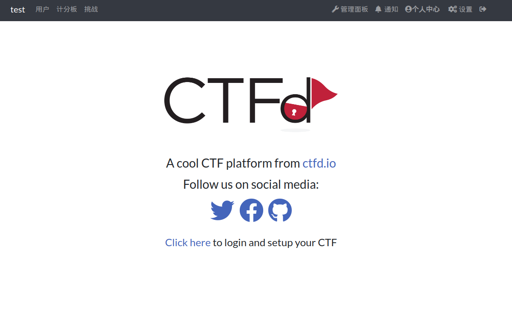
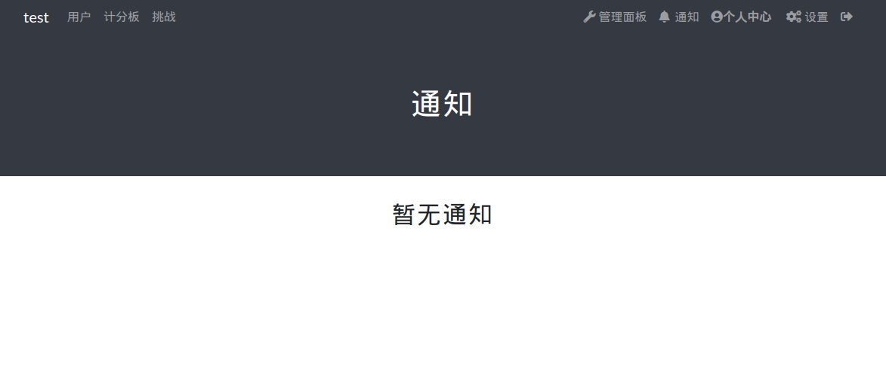
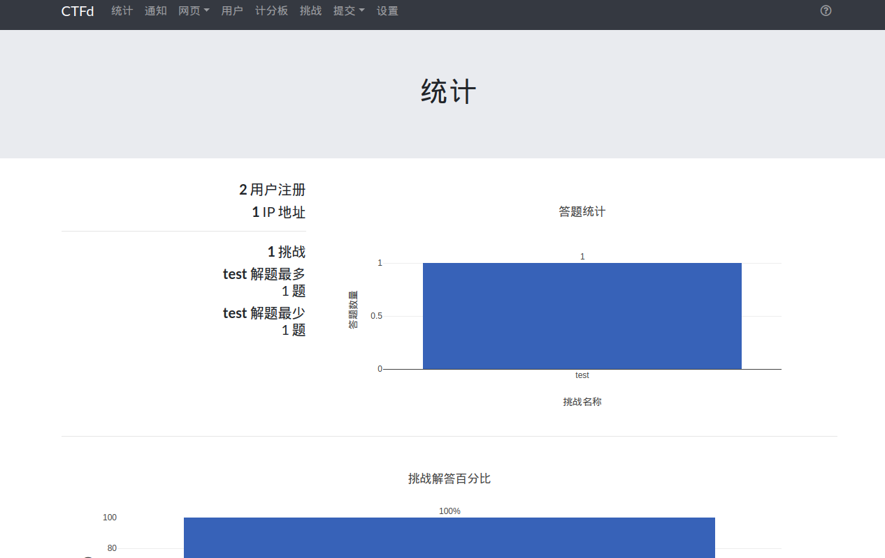
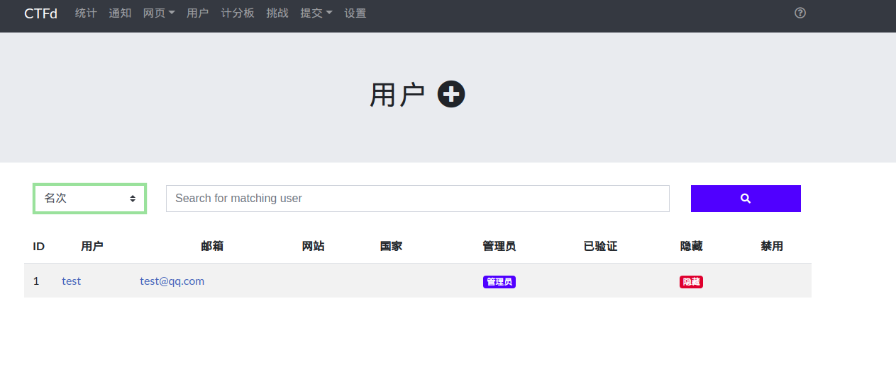
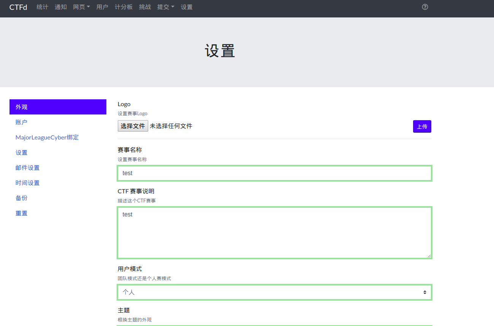
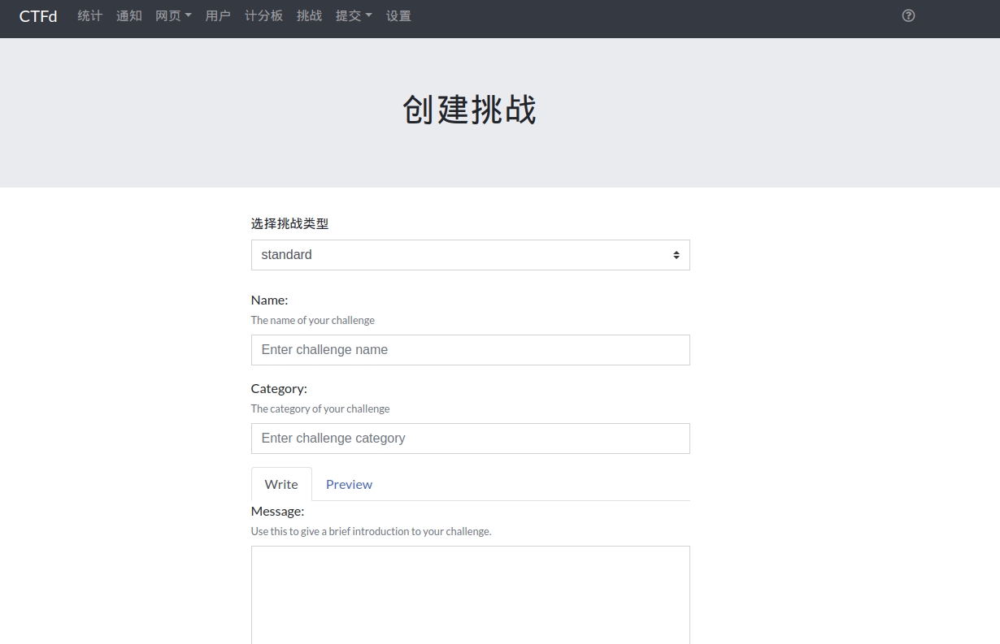
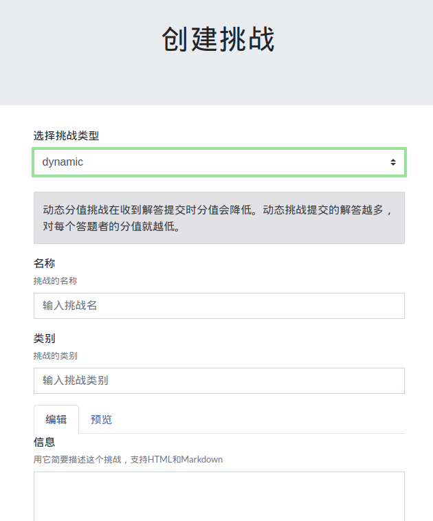

# CTFd_themes_cn

本库是由CTFd v2.3.1中提取的主题文件翻译完成，完成度大概90%，只有少部分没找到内容，或没法直接翻译的内容没有翻译。本翻译仅为机翻加个人理解，仅为个人使用，若有错误请指正！

**本库仅保证与 CTFd v2.3.1兼容，其他版本不保证完全兼容**

# 使用

- 获得CTFd v2.3.1，解压

```bash
wget -O CTFd-2.3.1.tar.gz https://github.com/CTFd/CTFd/archive/2.3.1.tar.gz
tar -zxvf CTFd-2.3.1.tar.gz
```

- 获得主题文件,解压

```bash
<<<<<<< HEAD
wget -O themes_cn.tar.gz https://eonun.coding.net/api/user/eonun/project/CTFd_themes_cn/git/releases/attachments/download/30767
=======
wget -O themes_cn.tar.gz https://github.com/eonun/CTFd_themes_cn/releases/download/v2.3.1_cnv1/themes_cn.tar.gz
>>>>>>> d04e6529a7944f0f21662e28323e10119f93f3f3
tar -zxvf themes_cn.tar.gz
```

- 备份原主题文件，替换主题文件

```bash
mv CTFd-2.3.1/CTFd/themes CTFd-2.3.1/CTFd/themes.backup
mv themes_cn CTFd-2.3.1/CTFd/themes
```

- 部署

```bash
docker build -t CTFd .
docker run -p 8000:8000 -itd CTFd
```


<<<<<<< HEAD
# 预览

















- 未汉化点







